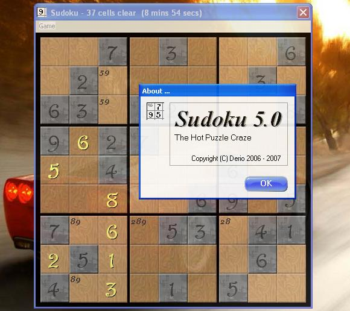



## Sudoku \- The Hot Puzzle Crazy 5\.0

### Description

Back to basic! Enjoy traditional Sudoku game using Sudoku 5.0. Solve thousand of puzzle without any advance facilities but pencil! No hint, no filtered option, and no solver facilities (very funny &#8230;). But as a matter of fact, you get more fun!
 
### More Info
 

             |
---                |---
**Submitted On**   |2007-07-04 23:35:06
**By**             |[Derio](https://github.com/Planet-Source-Code/PSCIndex/blob/master/ByAuthor/derio.md)
**Level**          |Intermediate
**User Rating**    |5.0 (20 globes from 4 users)
**Compatibility**  |VB 6\.0
**Category**       |[Games](https://github.com/Planet-Source-Code/PSCIndex/blob/master/ByCategory/games__1-38.md)
**World**          |[Visual Basic](https://github.com/Planet-Source-Code/PSCIndex/blob/master/ByWorld/visual-basic.md)
**Archive File**   |[Sudoku\_\-\_T207402752007\.ZIP](https://github.com/Planet-Source-Code/derio-sudoku-the-hot-puzzle-crazy-5-0__1-68942/archive/master.zip)

